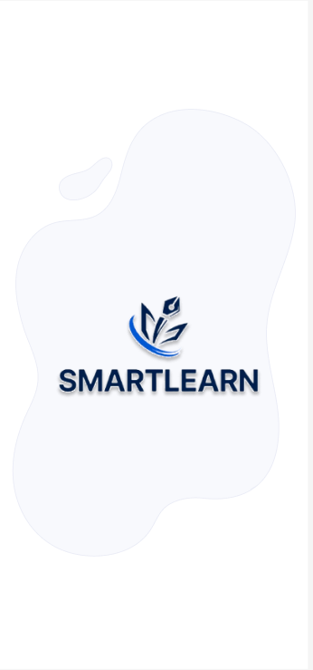
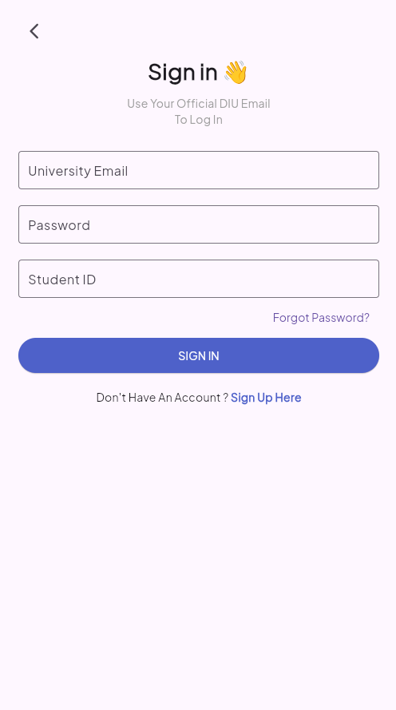
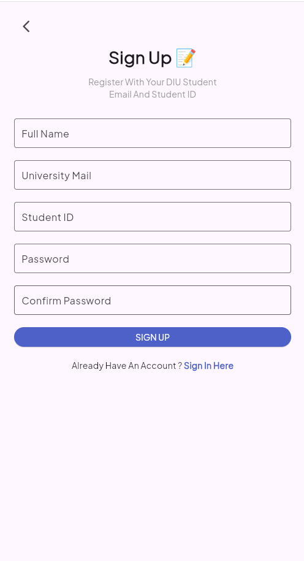
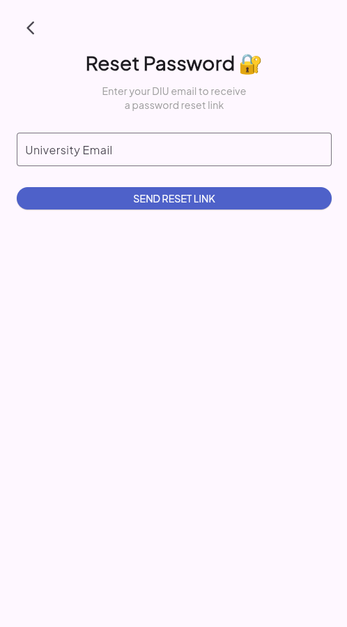
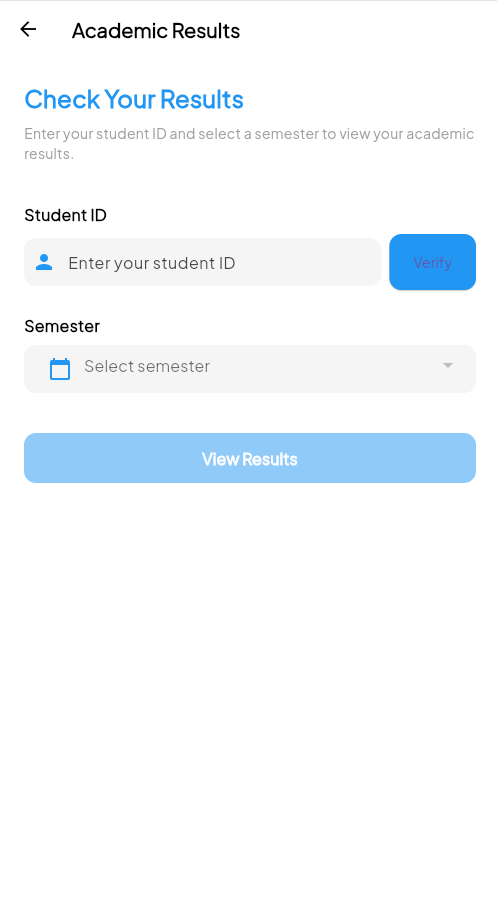

# 📱 SmartLearn – Your Smart Academic Companion

SmartLearn is a Flutter-based mobile application designed exclusively for students of Daffodil International University (DIU). It aims to enhance academic success by providing smart and organized access to essential learning resources such as previous year questions, lecture slides, and more — all in one place.

## ✨ Features

🔐 Secure Authentication: Sign in and sign up using your DIU Student ID and email.

🎉 Onboarding Experience: A smooth onboarding flow introducing the app’s core features.

📂 Smart Resource Access: Get previous year questions, lecture notes, and important files.

📊 Academic Results: View and track your semester-wise academic performance.

🌐 Firebase Integration: Handles authentication and backend support (in progress).

🧪 Form Validation: Ensures valid DIU email, student ID, and password confirmation during sign-up.

## 🚀 Tech Stack

- Flutter & Dart

- Firebase Authentication

- SharedPreferences for persistent state (onboarding screen tracking)

- REST API Integration (for fetching academic results from the DIU Student Portal)

- VS Code for development

## 🛠️ Future Enhancements
🌐 Cloud Firestore integration for storing and fetching resources.

📅 Class schedule and reminders.

🧪 Quiz Functionality: Interactive quizzes for self-assessment and exam preparation

## 🎨 Figma Design

Check out the design of the SmartLearn app on [Figma](https://www.figma.com/design/C1q5oNe2c8lnHHOsXYflse/Smart-Learn?node-id=0-1&t=tvcvU8Q7QrywXtYM-1).

## 🎬 Demo Video

Watch the demo video of SmartLearn [Watch the Demo](https://drive.google.com/file/d/107W2z0ve53nVVJxsidJ0qBXuizsRBWJ0/view?usp=sharing).

## 📄 Project Report

You can download the full project report [here](https://www.overleaf.com/read/zjyzmtgwjyzg#58fd59).

## 📸 Screenshots
### 🎬 Splash Screen

### 🚀 Onboarding Flow

### 🔐 Sign In / Sign Up / Reset

  
  
  

### 📊 Academic Results

